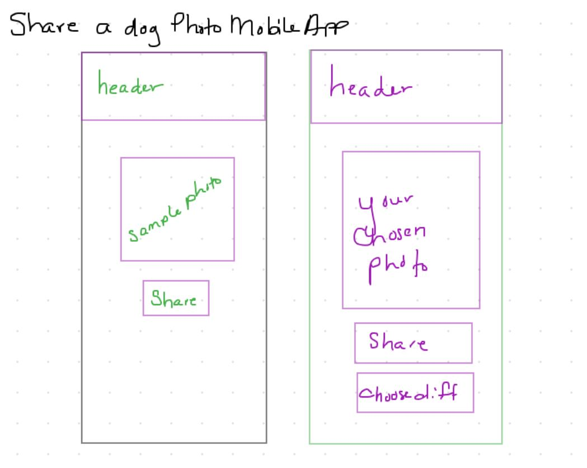

# LAB - React-Native Phone App

## Project: Self-Directed: Share a Dog Photo

### Author: Ashley Biermann

### Overview
- This is a mobile application that will allow you to share a photo from your device with someone with whom you are connected
- Requires permission to access Photo libary and Sharing permissions
  - Some possible ways to share include: text, messenger, email

### Links and Resources

- [submission PR](https://github.com/401-advanced-javascript-ashley-biermann/js401phoneapp/pull/3)
- [ci/cd](https://github.com/401-advanced-javascript-ashley-biermann/notes/tree/master/.github/workflows) (GitHub Actions)

### Setup

#### How to initialize/run your application (where applicable)

- `expo start`

#### How to use your library (where applicable)

#### Tests

- not yet implemented

#### UML

- 
